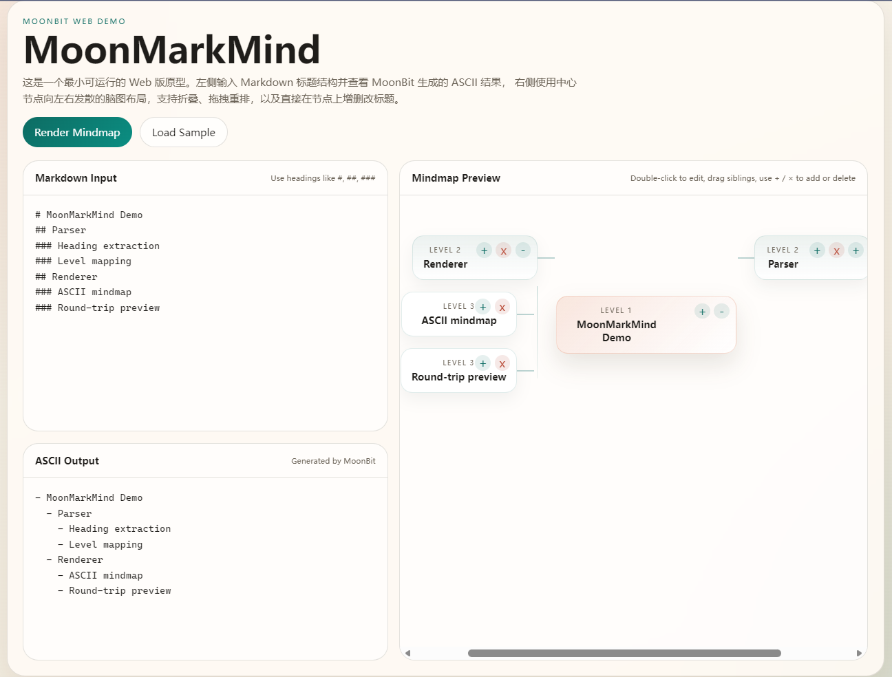

# MoonMarkMind

MoonMarkMind 是一个用 MoonBit 编写的 Markdown 脑图编辑 Demo。它负责把 Markdown 解析成结构树，并在浏览器里提供交互式编辑、预览和导出能力。

## 当前界面

- 左侧 `.md文档` 区可直接编辑 Markdown
- 编辑区带行号和更清晰的书写背景
- 编辑器顶部提供新建、上传等按钮
- 右侧 `脑图` 区支持自定义下拉菜单，不再依赖浏览器原生样式
- 支持 `思维图 / 逻辑图 / 树状图`
- 支持 `线条 / 填充`
- 支持 `最小 / 中等 / 全部` 层级视图
- 支持导出 `.PNG / .SVG / .HTML`
- 支持工具栏操作和缩放比例显示



上面的示意图继续保留为 `demo1.png`，用于展示当前界面效果。

## 核心能力

- Markdown 标题解析
- 标题 + 列表的结构树解析
- Markdown 回写
- 节点重命名
- 新增子节点
- 删除节点
- 同级节点拖拽重排

## 项目结构

- `heading_parser.mbt`：解析 Markdown 标题和列表结构
- `outline_tree.mbt`：树结构遍历与组装
- `outline_model.mbt`：树结构导出与节点编辑逻辑
- `web_api.mbt`：浏览器调用入口
- `web_layout.mbt`：Web 页面骨架和按钮区域
- `web_dom.mbt`：浏览器 DOM 绑定、文件导入导出、前端交互桥接
- `web_frontend.mbt`：Web 端状态协同、视图更新和交互流程
- `web/index.html`：Web Demo 页面
- `build-web.ps1`：生成浏览器可用 bundle

## 本地运行

先检查和测试：

```powershell
moon check
moon test
```

运行命令行 Demo：

```powershell
moon run cmd/main
```

生成 Web bundle：

```powershell
powershell -ExecutionPolicy Bypass -File .\build-web.ps1
```

启动静态服务：

```powershell
python -m http.server 8080 -d web
```

然后访问：

```text
http://localhost:8080
```

## 当前限制

- 结构树已支持标题和列表，但节点正文、引用、代码块等内容的完整导出还在继续完善。
- 当前导出以结构为主，复杂正文块的可逆性还不算完整。
- Web bundle 需要通过脚本重新生成。

## 校验命令

```powershell
moon info
moon fmt
moon test
```
